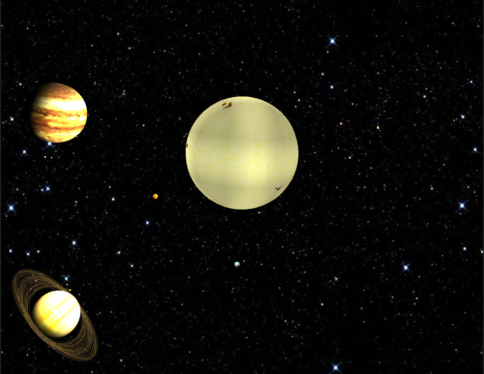
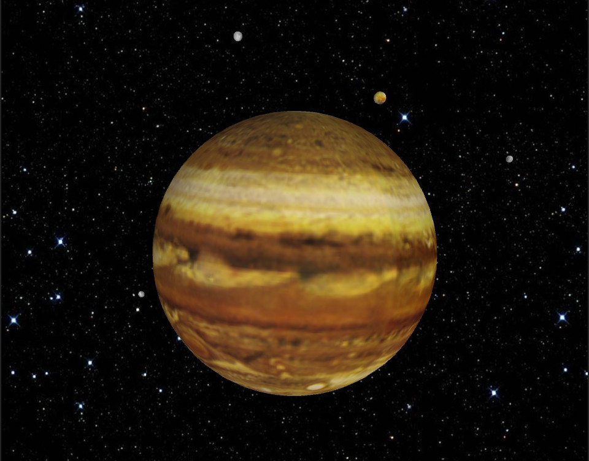
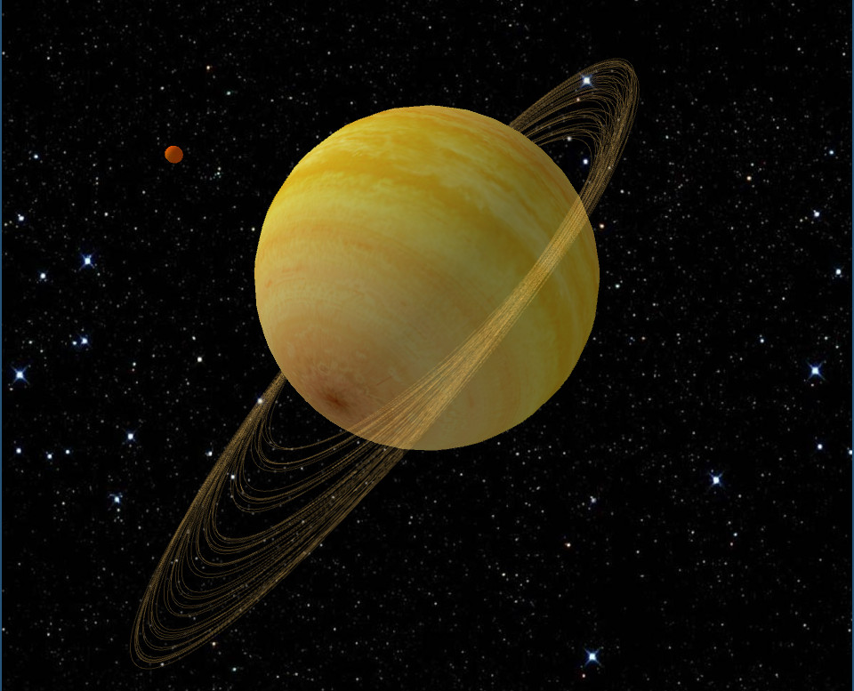

  

# Sistema Solar básico basado en Processing
El objetivo del trabajo es la implementación muy básica de un pequeño entorno 3D basado en el proyecto Processing. Se intentó mantener las proporciones aproximadas de los diferentes tamaños de los planetas y satélites, sin embargo hubo otras dimensiones, como por ejemplo el tamaño de las órbitas o la velocidad de los objetos, que no se respetaron para una mejor visualización del entorno.

Solo se incorporó al sistema, desde lo más cercano al Sol a más lejos, todos los planetas y satélites naturales hasta Saturno, con su satélite Titan.

## Controles
La aplicación se desenvuelve en dos modos básicos: Uno donde se expone todo el sistema solar con los diferentes planetas orbitando alrededor del Sol; y un segundo donde se muestra cada planeta con sus respectivos satélites. Para cambiar de un modo a otro se debe presionar la tecla *T*.

Luego, las siguientes teclas ejecutan las siguientes acciones:
- *D*: Detener la animación.
- *R*: Resumir la animación, y en el modo de visualización de planeta con sus satélites avanza al siguiente planeta.
- *Flecha izquierda y flecha derecha*: Rotar el entorno 3D.
- *Flecha arriba y abajo*: En el modo de visualización de planeta con sus satélites, avanza al próximo planeta o al anterior respectivamente.

También se importó una cámara para poder manejar la visualización del entorno mediante diferentes acciones con el mouse.

## Recursos
Todas las imágenes colocadas como texturas de los diferentes planetas y satélites (que en el proyecto se encuentran en la carpeta [assets](./assets/)) se obtuvieron de los recursos 3D que brinda la [NASA](https://nasa3d.arc.nasa.gov/images).

## TO DO
- Solo se cargaron planetas y satélites hasta Saturno y su satélite Titan. Esto se debe a dos motivos: El primero es que cada vez que se ejecuta la aplicación, se levantan todas las imágenes descargadas de la NASA, lo que demora mucho su inisio; y segundo, el código es muy repetitivo, por lo que se puede optimizar la carga de los diferentes objetos sin necesidad de escribir tanto código.
- El zoom queda deshabilitado en la visualización de planeta con sus respectivos satélites, y los planetas pequeños no se los puede observar con detalle.